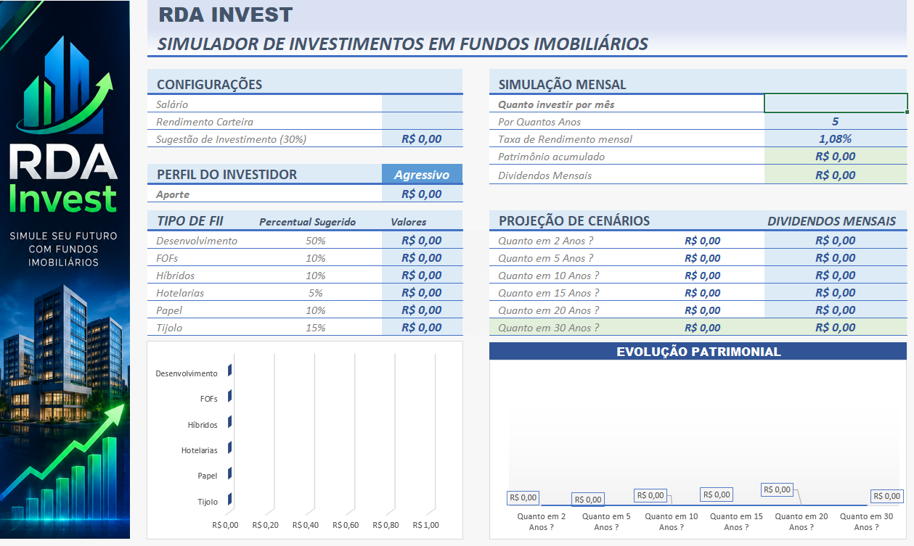
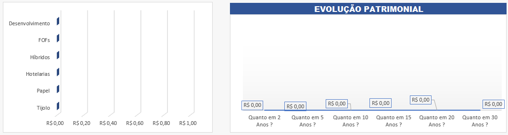

# RDA Invest – Simulador de Investimentos em Fundos Imobiliários

## 📊 Sobre o projeto

O RDA Invest é uma ferramenta desenvolvida em Excel com o objetivo de simular investimentos em Fundos de Investimento Imobiliário (FIIs).

A ferramenta permite ao usuário informar dados como salário, valor disponível para investimento, período de investimento e taxa de rendimento, apresentando projeções de patrimônio acumulado e dividendos mensais.

## 🎯 Objetivo

Aplicar os conhecimentos adquiridos no curso de Excel com IA da DIO na construção de uma ferramenta prática de simulação financeira.

## 🚀 Funcionalidades

- Definição de salário;
- Cálculo de sugestão de investimento;
- Seleção de perfil do investidor;
- Distribuição do investimento entre diferentes tipos de FIIs;
- Simulação de aportes mensais;
- Cálculo do patrimônio acumulado;
- Estimativa de dividendos mensais;
- Projeção de diferentes cenários de investimento;
- Gráficos para visualização dos resultados;
- Análise visual dos dados.

## 👤 Perfis de investimento

A ferramenta trabalha com três perfis:

- Conservador
- Moderado
- Agressivo

Cada perfil possui uma distribuição percentual diferente entre os tipos de Fundos Imobiliários considerados na simulação.

## 🏢 Tipos de FIIs

A ferramenta considera:

- Desenvolvimento
- FOFs
- Híbridos
- Hotelarias
- Papel
- Tijolo

## 📈 Cenários

A simulação permite analisar diferentes períodos:

- 2 anos
- 5 anos
- 10 anos
- 15 anos
- 20 anos
- 30 anos

Dessa forma, o usuário consegue visualizar o impacto do tempo, dos aportes e da rentabilidade sobre o patrimônio projetado.

## 🎨 Identidade visual

O projeto utiliza a identidade visual da marca fictícia RDA Invest, com elementos gráficos inspirados no mercado financeiro e em interfaces modernas de investimentos.

## 🖼️ Capturas de tela

### Dashboard principal

### Distribuição dos investimentos

## 📁 Arquivos

- `RDA_Invest_Simulador_FII.xlsx` – planilha principal do projeto.
- `images/` – capturas de tela utilizadas para documentação.

## ⚠️ Observação

Os valores apresentados pela ferramenta são projeções utilizadas para fins acadêmicos e de simulação. Não representam garantia de rentabilidade nem recomendação de investimento.

## 👨‍💻 Projeto acadêmico

Projeto desenvolvido como parte do curso de Excel com IA.

**RDA Invest – Simulador de Investimentos em Fundos Imobiliários**
